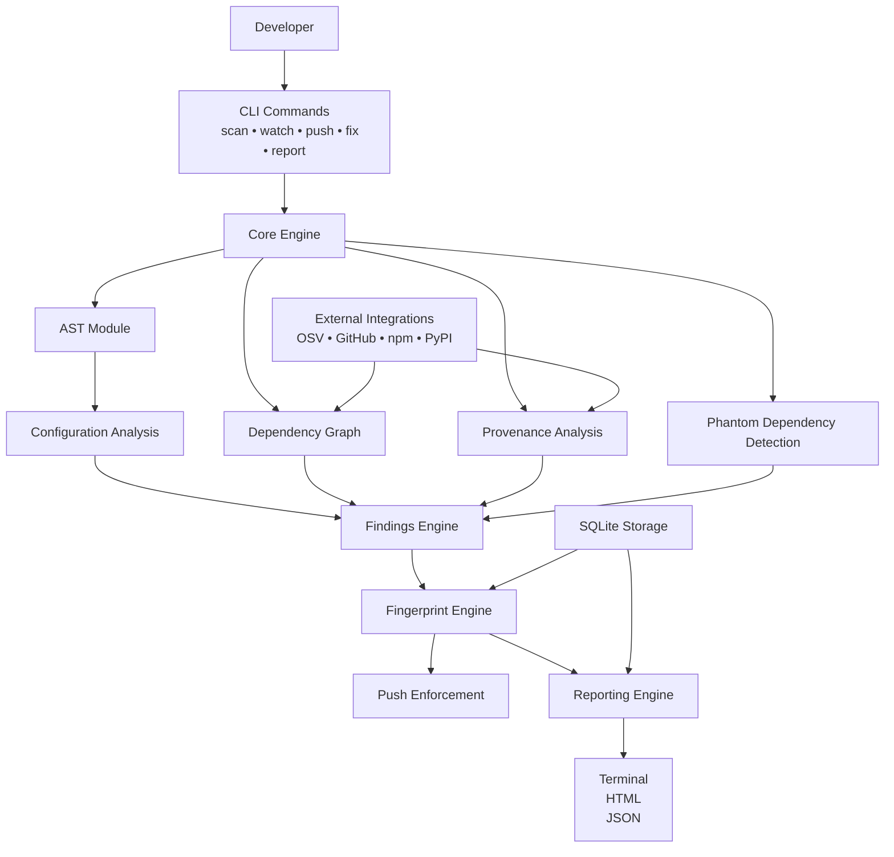

# SpiritCLI Core Architecture

> This document describes the complete internal architecture of the SpiritCLI engine.

---

# Purpose of This Folder

The `spirit/` directory contains the entire implementation of SpiritCLI.

Everything the user experiences through:

spirit scan
spirit watch
spirit push
spirit fix
spirit report

is implemented inside this directory.

This folder is divided into multiple subsystems.

Each subsystem is responsible for a specific feature and communicates with other subsystems through well-defined interfaces.

---

# Complete Internal Structure

```text
spirit/

├── cli/
│   ├── scan.py
│   ├── watch.py
│   ├── push.py
│   ├── fix.py
│   └── report.py
│
├── core/
│   ├── scanner.py
│   ├── findings.py
│   ├── severity.py
│   ├── fingerprint.py
│   └── engine.py
│
├── ast/
│   ├── parser.py
│   ├── visitors.py
│   ├── extractors.py
│   └── patterns.py
│
├── config_analysis/
│   ├── analyzer.py
│   ├── rule_engine.py
│   └── knowledge_base/
│       ├── bcrypt.json
│       ├── jwt.json
│       ├── axios.json
│       ├── express.json
│       └── mongoose.json
│
├── dependency_graph/
│   ├── builder.py
│   ├── resolver.py
│   ├── tracer.py
│   └── graph.py
│
├── provenance/
│   ├── trust_engine.py
│   ├── maintainer_score.py
│   ├── typosquat.py
│   ├── github_analyzer.py
│   └── registry_checker.py
│
├── phantom/
│   ├── detector.py
│   ├── import_graph.py
│   ├── manifest_graph.py
│   └── comparator.py
│
├── remediation/
│   ├── fixer.py
│   ├── patch_generator.py
│   ├── diff_viewer.py
│   └── upgrade_engine.py
│
├── scoring/
│   ├── config_score.py
│   ├── cve_score.py
│   ├── trust_score.py
│   ├── freshness_score.py
│   ├── phantom_score.py
│   └── calculator.py
│
├── git/
│   ├── hook_manager.py
│   ├── push_guard.py
│   ├── diff_scanner.py
│   └── audit_log.py
│
├── reporting/
│   ├── report_generator.py
│   ├── html_exporter.py
│   ├── json_exporter.py
│   ├── trajectory.py
│   └── root_cause.py
│
├── integrations/
│   ├── osv.py
│   ├── github_api.py
│   ├── npm_registry.py
│   ├── pypi.py
│   └── license_api.py
│
├── storage/
│   ├── database.py
│   ├── schema.sql
│   ├── scans.db
│   └── history.py
│
├── models/
│   ├── finding.py
│   ├── dependency.py
│   ├── score.py
│   └── report.py
│
└── utils/
    ├── logger.py
    ├── constants.py
    ├── config.py
    └── helpers.py
```

---

# System Execution Flow



---

## Folder Documentation

<details>
<summary><strong>cli/ — Command Interface Layer</strong></summary>

## Purpose

This folder is responsible for translating user commands into actions.

Every command executed by the user enters the system through this layer.

Examples:

```bash
spirit scan
spirit watch
spirit push
spirit fix
spirit report
```

This layer contains no security logic.

It only validates arguments and forwards execution to the core engine.

### scan.py

Feature:

- spirit scan

Responsibilities:

- Parse scan arguments
- Validate target path
- Invoke scanner engine
- Display scan results

### watch.py

Feature:

- spirit watch

Responsibilities:

- Monitor file changes
- Trigger incremental scans
- Display live security feedback

### push.py

Feature:

- spirit push

Responsibilities:

- Run push validation
- Check fingerprint score
- Trigger push enforcement

### fix.py

Feature:

- spirit fix

Responsibilities:

- Run remediation engine
- Present patches
- Apply fixes

### report.py

Feature:

- spirit report

Responsibilities:

- Generate reports
- Export HTML
- Export JSON

---

</details>

<details>
<summary><strong>core/ — Central Orchestration Layer</strong></summary>

## Why This Folder Exists

The core layer acts as the brain of SpiritCLI.

Every subsystem eventually passes through this folder.

Without this layer:

- modules become tightly coupled
- features become difficult to maintain
- testing becomes impossible

### engine.py

Most important file in the project.

Responsibilities:

- Initialize scans
- Manage execution order
- Coordinate all modules
- Aggregate results

Typical execution:

```text
engine.py

 ↓

scanner.py

 ↓

config analyzer

 ↓

dependency graph

 ↓

scoring

 ↓

reporting
```

### scanner.py

Responsible for:

- Full scans
- Incremental scans
- File collection

### findings.py

Defines:

```python
CriticalFinding
HighFinding
MediumFinding
LowFinding
```

Standardizes all findings.

### severity.py

Converts findings into severity levels.

Maps:

CVSS → Critical/High/Medium/Low

### fingerprint.py

Computes:

Security Health Fingerprint

Used by:

- report
- push
- watch

---

</details>

<details>
<summary><strong>ast/ — Abstract Syntax Tree Analysis Engine</strong></summary>

# Purpose

The AST module is responsible for understanding source code.

Traditional scanners inspect only dependency manifests such as:

package.json
requirements.txt

SpiritCLI goes further.

It analyzes the actual application source code to understand:

- Which dependencies are imported
- Which APIs are being called
- Which configuration values are passed
- Which functions use specific dependencies

This module forms the foundation of:

- Configuration Context Analysis
- Phantom Dependency Detection
- Transitive Risk Tracing
- Auto Remediation

Without this module SpiritCLI would behave similarly to npm audit.

# Why AST Analysis Is Important

Consider:

```javascript
bcrypt.hashSync(password, 4);
```

A normal scanner sees:

```json
{
  "dependency": "bcrypt"
}
```

SpiritCLI sees:

```json
{
  "dependency": "bcrypt",
  "method": "hashSync",
  "parameter": "rounds",
  "value": 4
}
```

This additional context allows SpiritCLI to identify security issues that traditional tools miss.

# Execution Stage

Runs immediately after:

1. File discovery
2. Dependency discovery

Pipeline:

Source Files
↓
AST Parser
↓
AST Tree
↓
Visitors
↓
Extractors
↓
Security Analysis

# Folder Structure

ast/

├── parser.py
├── visitors.py
├── extractors.py
└── patterns.py

## parser.py

# Purpose

Transforms source code into AST objects.

Input:

```javascript
jwt.sign(data, key, {
  algorithm: "none",
});
```

Output:

AST tree representation.

Responsibilities:

- Parse source code
- Detect syntax errors
- Build AST
- Provide traversal entry point

Used By:

- visitors.py

Owner:

Lokesh

## visitors.py

# Purpose

Traverses AST nodes.

Similar to walking through a tree.

Example:

Program
│
├── ImportDeclaration
│
├── FunctionDeclaration
│
└── CallExpression

Responsibilities:

- Visit every node
- Collect interesting nodes
- Pass nodes to extractors

Detects:

- imports
- function calls
- object literals
- variable declarations

Used By:

- extractors.py

## extractors.py

# Purpose

Extract meaningful security data from AST nodes.

Example:

Input:

```javascript
bcrypt.hashSync(password, 4);
```

Output:

```json
{
  "library": "bcrypt",
  "method": "hashSync",
  "parameter": "rounds",
  "value": 4
}
```

Extracts:

- imports
- configurations
- function invocations
- dependency usage

Used By:

- config_analysis
- phantom detection
- dependency tracing

## patterns.py

# Purpose

Contains AST patterns used for detection.

Examples:

bcrypt patterns

JWT patterns

Axios patterns

Express patterns

Example:

```python
BCRYPT_HASH_PATTERN
JWT_SIGN_PATTERN
AXIOS_CREATE_PATTERN
```

Allows reusable detection logic.

Used By:

- extractors.py
- remediation/

# Outputs Produced

The AST module produces:

```json
{
 "imports":[...],
 "configurations":[...],
 "calls":[...]
}
```

These outputs are consumed by:

- config_analysis/
- phantom/
- dependency_graph/

# Feature Mapping

Feature 1:
Configuration Context Analysis

Feature 2:
Transitive Dependency Tracing

Feature 6:
Phantom Dependency Detection

Feature 7:
Auto Remediation

---

</details>

<details>
<summary><strong>config_analysis/ — Configuration Context Analysis Engine</strong></summary>

# Purpose

This is the most important folder in SpiritCLI.

It implements the project's primary innovation.

Most security scanners ask:

"Does this dependency have a CVE?"

SpiritCLI asks:

"Is this dependency configured safely?"

# Example

Safe:

```javascript
bcrypt.hashSync(password, 12);
```

Unsafe:

```javascript
bcrypt.hashSync(password, 4);
```

Both use the same dependency version.

Traditional scanners see no difference.

SpiritCLI detects the security risk.

# Responsibilities

This module:

- Receives extracted configurations
- Compares them against security rules
- Generates findings
- Calculates configuration risk

# Folder Structure

config_analysis/

├── analyzer.py
├── rule_engine.py
└── knowledge_base/

    ├── bcrypt.json
    ├── jwt.json
    ├── axios.json
    ├── express.json
    └── mongoose.json

## analyzer.py

# Purpose

Main analysis engine.

Receives:

```json
{
  "library": "bcrypt",
  "parameter": "rounds",
  "value": 4
}
```

Coordinates all configuration analysis.

Responsibilities:

- Load extracted configurations
- Load security rules
- Execute rule engine
- Generate findings

Used By:

core/scanner.py

## rule_engine.py

# Purpose

Decision-making system.

Determines whether a configuration is:

SAFE
WARNING
CRITICAL

Example:

Rule:

```json
{
  "minimum": 10
}
```

Detected:

```json
{
  "value": 4
}
```

Output:

```json
{
  "severity": "critical"
}
```

Responsibilities:

- Rule matching
- Severity assignment
- Risk classification

## knowledge_base/

# Purpose

Central security knowledge repository.

Stores all security recommendations.

Each file contains rules for a single library.

### bcrypt.json

Responsible For

- rounds
- salt strength
- hashing safety

Example:

```json
{
  "rounds": {
    "minimum": 10
  }
}
```

### jwt.json

Responsible For

- algorithm validation
- token expiration
- signing configuration

Detects:

algorithm:none

### axios.json

Responsible For

- TLS validation
- SSL verification
- certificate validation

Detects:

rejectUnauthorized:false

### express.json

Responsible For

- security headers
- cors configuration
- cookie security

### mongoose.json

Responsible For

- schema validation
- injection protection
- strict mode

# Outputs

Produces:

Security Findings

Example:

```json
{
  "severity": "critical",
  "library": "bcrypt",
  "reason": "Rounds below minimum"
}
```

# Feature Mapping

Feature 1:
Configuration Context Analysis

Feature 3:
Security Fingerprint

Feature 7:
Auto Remediation

---

</details>

<details>
<summary><strong>dependency_graph/ — Dependency Relationship & Risk Tracing Engine</strong></summary>

# Purpose

This module understands how dependencies relate to each other.

Modern applications contain:

50–100 direct dependencies

and

500–2000 transitive dependencies.

SpiritCLI must determine:

- Which dependency introduced a vulnerable package
- Whether the vulnerable package is reachable
- Which functions are affected

# Example

Application

↓

payment-sdk

↓

bank-utils

↓

crypto-js

↓

MD5

SpiritCLI can trace:

processPayment()

↓

payment-sdk

↓

crypto-js

↓

MD5

This allows precise risk analysis.

# Folder Structure

dependency_graph/

├── builder.py
├── resolver.py
├── tracer.py
└── graph.py

## builder.py

# Purpose

Constructs dependency graphs.

Input:

package.json

Output:

Dependency Tree

Example:

Application
│
├── axios
│
├── express
│
└── payment-sdk

Responsibilities:

- Parse manifests
- Build adjacency lists
- Create dependency relationships

## resolver.py

# Purpose

Resolves dependency chains.

Example:

Application

↓

payment-sdk

↓

bank-utils

↓

crypto-js

Responsibilities:

- Discover transitive dependencies
- Resolve dependency hierarchy
- Detect dependency depth

## tracer.py

# Purpose

Core tracing engine.

Answers:

How does a vulnerable package connect to my application?

Example:

Input:

crypto-js

Output:

processPayment()
↓
payment-sdk
↓
bank-utils
↓
crypto-js

Responsibilities:

- Path tracing
- Reachability analysis
- Blast radius analysis

## graph.py

# Purpose

Graph data structures.

Contains:

DependencyNode

DependencyEdge

DependencyGraph

Responsibilities:

- Store graph
- Query graph
- Traverse graph

Used By:

builder.py
resolver.py
tracer.py

# Outputs

Produces:

```json
{
  "source": "processPayment",
  "target": "crypto-js",
  "path": ["payment-sdk", "bank-utils", "crypto-js"]
}
```

# Why This Feature Matters

Traditional scanners:

Vulnerable Package Found

SpiritCLI:

Vulnerable Package Found

AND

It is reachable through:

processPayment()

AND

Used by:

Payment API

AND

Impacts:

Customer transactions

This provides significantly more context.

# Feature Mapping

Feature 2:
Transitive Dependency Risk Tracing

Feature 3:
Security Fingerprint

Feature 7:
Auto Remediation

---

</details>

<details>
<summary><strong>provenance/ — Supply Chain Trust & Provenance Analysis Engine</strong></summary>

# Purpose

Traditional dependency scanners only answer:

"Is this package vulnerable?"

SpiritCLI also answers:

"Can this package be trusted?"

A package may have:

- No CVEs
- Recent releases
- Working functionality

and still be dangerous.

Examples:

- Malicious maintainer takeover
- Typosquatting attack
- Abandoned package
- Repository compromise
- Suspicious package publication

The provenance module evaluates the trustworthiness of dependencies before considering vulnerabilities.

# Why This Module Exists

Modern software supply-chain attacks are increasing.

Examples:

- XZ Utils Backdoor
- event-stream npm attack
- ua-parser-js compromise
- SolarWinds attack

Traditional scanners failed because:

✓ No CVE existed initially

SpiritCLI attempts to identify trust signals before a vulnerability is publicly disclosed.

# Execution Stage

Runs after:

Dependency Discovery

Pipeline:

Dependencies
↓
Registry Analysis
↓
Repository Analysis
↓
Trust Evaluation
↓
Trust Score

# Folder Structure

provenance/

├── trust_engine.py
├── maintainer_score.py
├── typosquat.py
├── github_analyzer.py
└── registry_checker.py

## trust_engine.py

# Purpose

Central coordinator for provenance analysis.

Responsibilities:

- Aggregate trust signals
- Calculate final trust score
- Normalize metrics
- Generate provenance findings

Inputs:

- GitHub metrics
- Registry metrics
- Typosquat results
- Maintainer analysis

Outputs:

```json
{
  "package": "jsonwebtoken",
  "trust_score": 84
}
```

Used By:

- scoring/
- reporting/

## maintainer_score.py

# Purpose

Evaluate package maintainers.

Checks:

- Number of maintainers
- Activity level
- Contribution diversity
- Bus factor

Example:

Single maintainer:

Risk ↑

10 maintainers:

Risk ↓

Responsibilities:

- Maintainer count analysis
- Maintainer diversity scoring
- Activity tracking

## typosquat.py

# Purpose

Detect malicious packages impersonating popular libraries.

Examples:

Real:

express

Malicious:

expres
expresss
exppress

Responsibilities:

- String similarity matching
- Levenshtein distance analysis
- Popular package comparison

Example Output:

```json
{
  "package": "expresss",
  "risk": "high"
}
```

## github_analyzer.py

# Purpose

Analyze repository health.

Checks:

- Commit frequency
- Issue activity
- Release frequency
- Repository age
- Contributor activity

Example:

Repository inactive for:

18 months

↓

Trust score reduced.

---

## registry_checker.py

# Purpose

Analyze package registry metadata.

Checks:

- Publish frequency
- Version consistency
- Release anomalies
- Package metadata

Can detect:

- Suspicious package publication
- Unusual release behavior

---

# Outputs

Produces:

```json
{
  "package": "axios",
  "trust_score": 92,
  "risk": "low"
}
```

# Feature Mapping

Feature 5:
Provenance Trust Score

Feature 3:
Security Fingerprint

Feature 8:
Spirit Report

# Dependencies

Consumes:

- integrations/github_api.py
- integrations/npm_registry.py
- integrations/pypi.py

Provides Data To:

- scoring/
- reporting/

# Owner

Anish

---

</details>

<details>
<summary><strong>phantom/ — Phantom Dependency Detection Engine</strong></summary>

# Purpose

Detect inconsistencies between:

What the project declares

and

What the project actually uses.

This module identifies:

1. Ghost Dependencies
2. Undeclared Imports

# Why This Matters

Unused dependencies increase:

- Attack surface
- Maintenance burden
- CVE exposure

Undeclared imports create:

- Build instability
- Dependency ambiguity
- Security blind spots

# Example

package.json

```json
{
  "dependencies": {
    "lodash": "4.17.21"
  }
}
```

Codebase:

```javascript
import axios
```

Results:

Ghost Dependency:

lodash

Undeclared Import:

axios

# Execution Stage

Runs after:

AST Analysis

Pipeline:

AST Imports
↓
Manifest Dependencies
↓
Graph Comparison
↓
Phantom Detection

# Folder Structure

phantom/

├── detector.py
├── import_graph.py
├── manifest_graph.py
└── comparator.py

## detector.py

# Purpose

Main phantom dependency coordinator.

Responsibilities:

- Run comparison process
- Generate findings
- Produce remediation suggestions

Outputs:

```json
{
 "ghost_dependencies":[...],
 "undeclared_imports":[...]
}
```

## import_graph.py

# Purpose

Build graph from source code imports.

Input:

```javascript
import axios
import express
```

Output:

```json
["axios", "express"]
```

Uses:

AST Extractors

Source:

ast/

## manifest_graph.py

# Purpose

Build graph from dependency manifests.

Supports:

- package.json
- requirements.txt

Example Output:

```json
["axios", "lodash", "express"]
```

## comparator.py

# Purpose

Compare import graph and manifest graph.

Detect:

Ghost Dependency

Declared
✓

Used
✗

Undeclared Import

Declared
✗

Used
✓

Responsibilities:

- Set comparison
- Difference analysis
- Risk classification

# Outputs

Produces:

```json
{
  "ghost": ["lodash"],
  "undeclared": ["axios"]
}
```

# Feature Mapping

Feature 6:
Phantom Dependency Detection

Feature 3:
Security Fingerprint

Feature 7:
Auto Remediation

# Dependencies

Consumes:

- ast/
- dependency manifests

Provides Data To:

- remediation/
- scoring/
- reporting/

# Owner

Lokesh

---

</details>

<details>
<summary><strong>remediation/ — Smart Auto-Remediation Engine</strong></summary>

# Purpose

SpiritCLI should not only identify security problems.

It should help fix them.

The remediation engine generates:

- Configuration fixes
- Dependency fixes
- Manifest fixes

while maintaining developer control.

Nothing is modified automatically without review.

# Why This Module Exists

Traditional scanners provide:

"Problem found."

Developers must manually:

- Research fix
- Edit code
- Upgrade package
- Verify outcome

SpiritCLI automates most of this workflow.

# Example

Detected:

```javascript
bcrypt.hashSync(password, 4);
```

Suggested Fix:

```javascript
bcrypt.hashSync(password, 12);
```

# Execution Stage

Runs when:

```bash
spirit fix
```

is executed.

Pipeline:

Findings
↓
Fix Generation
↓
Diff Creation
↓
User Review
↓
Apply Changes

# Folder Structure

remediation/

├── fixer.py
├── patch_generator.py
├── diff_viewer.py
└── upgrade_engine.py

## fixer.py

# Purpose

Main remediation controller.

Responsibilities:

- Load findings
- Select fix strategy
- Coordinate remediation workflow

Acts as:

Central remediation engine.

## patch_generator.py

# Purpose

Generate code modifications.

Input:

```json
{
  "library": "bcrypt",
  "value": 4
}
```

Output:

```diff
- bcrypt.hashSync(password,4)
+ bcrypt.hashSync(password,12)
```

Responsibilities:

- Source patch generation
- Rule-driven modifications
- Safe replacements

## diff_viewer.py

# Purpose

Display changes before application.

Example:

```diff
- rejectUnauthorized:false
+ rejectUnauthorized:true
```

Responsibilities:

- Human-readable diffs
- Terminal visualization
- Change review

Used By:

spirit fix

## upgrade_engine.py

# Purpose

Handle dependency upgrades.

Example:

Before:

```json
lodash:4.17.15
```

After:

```json
lodash:4.17.21
```

Responsibilities:

- Version selection
- Upgrade planning
- Dependency updates

Future:

- Changelog analysis
- Breaking change detection

# Outputs

Produces:

```json
{
  "fixes_applied": 4,
  "score_improvement": 18
}
```

# Feature Mapping

Feature 7:
Smart Auto Remediation

Feature 1:
Configuration Context Analysis

Feature 6:
Phantom Dependency Detection

# Dependencies

Consumes:

- config_analysis/
- phantom/
- dependency_graph/
- findings

Provides Data To:

- reporting/
- storage/

# Owner

Tarun (Architecture)

- Lokesh (Code Patching Logic)

---

</details>

<details>
<summary><strong>scoring/ — Security Health Fingerprint Engine</strong></summary>

# Purpose

The scoring module is responsible for converting hundreds of security findings into a single understandable metric called the:

Security Health Fingerprint

The purpose of this module is to answer:

"How secure is this project right now?"

Instead of overwhelming developers with dozens of findings, SpiritCLI produces a measurable security score ranging from:

0 → 100

This score becomes the central metric used by:

- spirit scan
- spirit watch
- spirit push
- spirit report

# Why This Module Exists

Most security tools generate:

- Long vulnerability lists
- Massive reports
- Thousands of warnings

Developers often ignore them.

SpiritCLI converts all findings into a meaningful score.

Example:

```text
Configuration Safety : 80
CVE Exposure         : 60
Trust Score          : 90
Freshness            : 75
Phantom Risk         : 85

Final Score          : 78
```

This makes security easier to understand and track over time.

# Security Fingerprint Formula

Current Design

Configuration Safety : 30%
CVE Exposure : 25%
Provenance Trust : 20%
Dependency Freshness : 15%
Phantom Risk : 10%

Formula:

Score =
(Config × 0.30)

- (CVE × 0.25)
- (Trust × 0.20)
- (Freshness × 0.15)
- (Phantom × 0.10)

  ***

# Security Zones

<strong>Safe Zone</strong>

71–100

Meaning:

Project is production ready.

<strong>Warning Zone</strong>

36–70

Meaning:

Moderate risk exists.

Developer review required.

<strong>Quarantine Zone</strong>

0–35

Meaning:

Critical security problems detected.

Pushes may be blocked.

# Folder Structure

scoring/

├── config_score.py
├── cve_score.py
├── trust_score.py
├── freshness_score.py
├── phantom_score.py
└── calculator.py

## config_score.py

# Purpose

Calculates configuration security.

Consumes:

- Configuration findings
- Security rules

Example:

bcrypt rounds=4

↓

Critical

↓

Score reduced

Responsibilities:

- Weight unsafe configurations
- Aggregate configuration findings
- Produce Configuration Safety score

## cve_score.py

# Purpose

Calculate vulnerability impact score.

Consumes:

- OSV results
- CVSS scores

Example:

Critical CVE

↓

Major score reduction

Responsibilities:

- Evaluate CVE severity
- Normalize vulnerability impact
- Generate CVE component score

## trust_score.py

# Purpose

Calculate dependency trustworthiness.

Consumes:

- Provenance engine results

Factors:

- Maintainers
- Repository activity
- Typosquatting risk

Produces:

Trust score

## freshness_score.py

# Purpose

Evaluate dependency freshness.

Checks:

- Last release date
- Version age
- Maintenance activity

Example:

Package not updated for:

3 years

↓

Score reduction

## phantom_score.py

# Purpose

Calculate phantom dependency impact.

Consumes:

- Ghost dependencies
- Undeclared imports

More phantom dependencies

↓

Lower score

## calculator.py

# Purpose

Most important file in this folder.

Responsible for:

Combining all component scores.

Example:

```python
final_score =
(
 config_score * 0.30 +
 cve_score * 0.25 +
 trust_score * 0.20 +
 freshness_score * 0.15 +
 phantom_score * 0.10
)
```

Produces:

Final Security Fingerprint

# Outputs

Produces:

```json
{
  "score": 78,
  "zone": "SAFE"
}
```

# Feature Mapping

Feature 3:
Security Health Fingerprint

Feature 4:
Risk-Based Push Control

Feature 8:
Spirit Report

# Dependencies

Consumes:

- config_analysis/
- provenance/
- phantom/
- integrations/

Provides Data To:

- git/
- reporting/

# Owner

Tarun

---

</details>

<details>
<summary><strong>git/ — Risk-Based Push Enforcement Engine</strong></summary>

# Purpose

The Git module enforces security policies before code leaves the developer machine.

This module transforms SpiritCLI from:

Passive Scanner

into

Active Security Gatekeeper

# Why This Module Exists

Traditional tools:

✓ Generate reports

✗ Do not stop insecure deployments

Developers can ignore warnings.

SpiritCLI introduces:

Security Enforcement

The project security score directly affects whether code can be pushed.

# Security Zones

<strong>Quarantine</strong>

Score: 0–35

Action:

Push Blocked

<strong>Warning</strong>

Score: 36–70

Action:

Acknowledgement Required

<strong>Safe</strong>

Score: 71–100

Action:

Push Allowed

# Execution Flow

Developer

↓

git push

↓

SpiritCLI Hook

↓

Security Scan

↓

Fingerprint Score

↓

Policy Evaluation

↓

Allow / Block

# Folder Structure

git/

├── hook_manager.py
├── push_guard.py
├── diff_scanner.py
└── audit_log.py

## hook_manager.py

# Purpose

Manage Git Hooks.

Responsibilities:

- Install hooks
- Remove hooks
- Configure hooks

Supports:

- pre-push
- pre-commit (future)

Example:

```bash
spirit install-hooks
```

## push_guard.py

# Purpose

Main enforcement engine.

Responsible for:

- Reading fingerprint score
- Applying push policies
- Blocking dangerous pushes

Example:

```text
Fingerprint: 24

CRITICAL FINDINGS DETECTED

Push Blocked
```

This is the heart of Feature 4.

## diff_scanner.py

# Purpose

Optimize scanning speed.

Instead of:

Scanning entire repository

SpiritCLI scans:

Only modified files

Example:

```bash
git diff --name-only
```

Responsibilities:

- Incremental analysis
- Changed file detection
- Fast watch mode support

## audit_log.py

# Purpose

Maintain security audit trail.

Records:

- Push attempts
- Security scores
- Overrides
- User acknowledgements

Example:

```json
{
  "timestamp": "2025-06-01",
  "user": "developer",
  "score": 48,
  "action": "warning_override"
}
```

Used for:

Compliance
Forensics
Reporting

# Outputs

Produces:

```json
{
  "action": "blocked",
  "reason": "critical finding"
}
```

# Feature Mapping

Feature 4:
Risk-Based Push Control

Feature 3:
Security Fingerprint

# Dependencies

Consumes:

- scoring/
- core/
- storage/

Provides Data To:

- reporting/

# Owner

Likhith

---

</details>

<details>
<summary><strong>reporting/ — Security Intelligence Reporting Engine</strong></summary>

# Purpose

The reporting module transforms raw findings into understandable security intelligence.

This is the presentation layer of SpiritCLI.

It explains:

- What was found
- Why it matters
- How security changed
- What should be fixed

# Why This Module Exists

Developers do not want:

1000 lines of logs.

They want:

- Actionable insights
- Security trends
- Root causes
- Remediation guidance

The reporting module provides exactly that.

# Reporting Types

<strong>Terminal Reports</strong>

Displayed during scans.

<strong>JSON Reports</strong>

Used by:

- CI/CD
- SIEM systems
- Automation

<strong>HTML Reports</strong>

Used by:

- Security teams
- Auditors
- Project managers

# Folder Structure

reporting/

├── report_generator.py
├── html_exporter.py
├── json_exporter.py
├── trajectory.py
└── root_cause.py

## report_generator.py

# Purpose

Main reporting coordinator.

Collects:

- Findings
- Scores
- Trends
- Audit logs

Produces:

Unified report object.

Acts as central reporting engine.

## html_exporter.py

# Purpose

Generate professional HTML reports.

Features:

- Security dashboard
- Charts
- Findings tables
- Score breakdown

Output:

```bash
security_report.html
```

Used during:

- Demonstrations
- Security reviews
- Audits

## json_exporter.py

# Purpose

Generate machine-readable reports.

Used by:

- GitHub Actions
- CI/CD
- SIEM
- Automation pipelines

Output:

```json
{
  "score": 78,
  "findings": []
}
```

## trajectory.py

# Purpose

Track security score over time.

Responsible for:

Historical analysis

Example:

```text
Scan1 : 45
Scan2 : 52
Scan3 : 67
Scan4 : 81
```

Generates:

Security trajectory

Used for:

Feature 8

## root_cause.py

# Purpose

Explain why the score changed.

Example:

Score Drop:

78 → 60

Root Cause:

```text
JWT algorithm:none introduced

File:
auth.js

Commit:
8f9ac2
```

Responsibilities:

- Compare scans
- Identify changes
- Explain degradation

# Outputs

Produces:

Terminal Report

HTML Report

JSON Report

Security Trend Analysis

Root Cause Analysis

# Feature Mapping

Feature 8:
Spirit Report

Feature 3:
Security Fingerprint

Feature 4:
Risk-Based Push Control

# Dependencies

Consumes:

- scoring/
- storage/
- git/
- core/

Provides Data To:

Users

Security Teams

CI/CD Systems

# Owner

Anish

---

</details>

<details>
<summary><strong>integrations/ — External Services & Data Source Integration Layer</strong></summary>

# Purpose

The integrations layer is responsible for communicating with external services.

SpiritCLI does not maintain its own vulnerability database.

Instead, it collects security intelligence from trusted external sources.

This folder acts as the bridge between:

SpiritCLI

and

External Security Ecosystem

# Why This Module Exists

SpiritCLI requires information that cannot be generated locally.

Examples:

- CVE databases
- Package registries
- Repository metadata
- Package publication history

Rather than hardcoding this information, SpiritCLI retrieves it dynamically.

# Execution Stage

Runs during:

spirit scan

Pipeline:

Dependencies
↓
Integrations
↓
Security Data
↓
Analysis Engines

# Folder Structure

integrations/

├── osv.py
├── github_api.py
├── npm_registry.py
├── pypi.py
└── license_api.py

## osv.py

# Purpose

Communicates with:

OSV.dev

(Open Source Vulnerabilities Database)

Used For:

- CVE lookup
- Vulnerability discovery
- Severity retrieval

Input:

```json
{
  "package": "axios",
  "version": "1.5.0"
}
```

Output:

```json
{
  "cve": "GHSA-xxxx",
  "severity": "HIGH"
}
```

Consumed By:

- cve_score.py
- reporting/

## github_api.py

# Purpose

Communicates with GitHub.

Used For:

- Repository metadata
- Contributor information
- Commit activity
- Issue statistics
- Release history

Supports:

Feature 5

Provenance Trust Score

## npm_registry.py

# Purpose

Communicates with npm Registry.

Used For:

- Package metadata
- Publish dates
- Maintainer information
- Latest version lookup

Supports:

- Provenance Analysis
- Freshness Analysis

## pypi.py

# Purpose

Communicates with PyPI.

Used For:

Python package analysis.

Responsibilities:

- Package metadata retrieval
- Version history retrieval
- Release information retrieval

## license_api.py

# Purpose

Future module.

Used For:

License analysis.

Potential checks:

- GPL compatibility
- MIT
- Apache
- BSD

Future Feature:

Compliance Analysis

# Outputs

Produces:

```json
{
 "package":"axios",
 "latest_version":"1.9.0",
 "cves":[...]
}
```

# Feature Mapping

Feature 2:
Transitive Risk Analysis

Feature 3:
Security Fingerprint

Feature 5:
Provenance Trust

Feature 8:
Reporting

# Dependencies

Consumes:

External APIs

Provides Data To:

- provenance/
- scoring/
- reporting/
- dependency_graph/

# Owner

Anish

---

</details>

<details>
<summary><strong>storage/ — Persistence & Historical Analysis Layer</strong></summary>

# Purpose

The storage layer is responsible for preserving SpiritCLI data across scans.

Without storage:

Every scan would be independent.

SpiritCLI would be unable to:

- Track trends
- Compare historical scans
- Generate trajectory reports
- Explain score changes

# Why This Module Exists

Many SpiritCLI features depend on historical information.

Examples:

Security Trend Analysis

Score Trajectory

Root Cause Detection

Push Audit History

These features require persistent storage.

# Execution Stage

Runs during:

Every scan

Every report

Every push

Every remediation

# Folder Structure

storage/

├── database.py
├── schema.sql
├── scans.db
└── history.py

## database.py

# Purpose

Database abstraction layer.

Responsibilities:

- Create connections
- Execute queries
- Store findings
- Store scores

Acts as the central database gateway.

Used By:

All modules.

## schema.sql

# Purpose

Defines database structure.

Example Tables:

scans

findings

scores

audit_logs

history

This file initializes the database.

## scans.db

# Purpose

SQLite database file.

Stores:

- Scan history
- Findings
- Scores
- Audit logs

Note:

Usually generated automatically.

Not manually edited.

## history.py

# Purpose

Historical analysis engine.

Responsibilities:

- Retrieve previous scans
- Compare scan results
- Generate score history

Supports:

Feature 8

Spirit Report

# Example Stored Data

```json
{
  "scan_id": 24,
  "score": 76,
  "timestamp": "2026-07-14"
}
```

# Feature Mapping

Feature 3:
Fingerprint History

Feature 4:
Audit Logging

Feature 8:
Security Trajectory

# Dependencies

Consumes:

SQLite

Provides Data To:

- reporting/
- git/
- scoring/

# Owner

Anish

---

</details>

<details>
<summary><strong>models/ — Core Data Model Definitions</strong></summary>

# Purpose

The models layer defines the language spoken by SpiritCLI.

Every module exchanges information using models.

Without models:

Different modules would use inconsistent data formats.

This would make integration difficult.

# Why This Module Exists

Consider:

AST Analysis generates findings.

Reporting consumes findings.

Scoring consumes findings.

All must agree on the same structure.

Models provide that structure.

# Execution Stage

Used Everywhere.

Every subsystem imports models.

# Folder Structure

models/

├── finding.py
├── dependency.py
├── score.py
└── report.py

## finding.py

# Purpose

Represents a security finding.

Example:

```python
Finding(
 severity="critical",
 file="auth.js",
 message="JWT algorithm none"
)
```

Used By:

Nearly every module.

## dependency.py

# Purpose

Represents a dependency.

Example:

```python
Dependency(
 name="axios",
 version="1.5.0"
)
```

Supports:

- Dependency Graph
- Provenance
- Scoring

## score.py

# Purpose

Represents fingerprint scores.

Example:

```python
Score(
 total=78,
 zone="SAFE"
)
```

Used By:

- Reporting
- Git Enforcement

## report.py

# Purpose

Represents generated reports.

Contains:

- Findings
- Scores
- Trends

Acts as the final reporting model.

# Why Models Are Important

Benefits:

- Type Safety
- Consistency
- Easier Testing
- Easier Refactoring

# Feature Mapping

Used By:

ALL FEATURES

Feature 1 → 8

# Dependencies

Consumed By:

Every subsystem.

Provides:

Common Data Structures

# Owner

Shared Responsibility

All Developers

---

</details>

<details>
<summary><strong>utils/ — Shared Utilities & Infrastructure Helpers</strong></summary>

# Purpose

The utilities folder contains reusable helper functions.

These are pieces of functionality used throughout the project but which do not belong to any specific feature.

# Why This Module Exists

Without utilities:

Code duplication increases.

Example:

Logging code repeated.

Configuration loading repeated.

Path handling repeated.

Utilities centralize these common tasks.

# Execution Stage

Used Everywhere.

# Folder Structure

utils/

├── logger.py
├── constants.py
├── config.py
└── helpers.py

## logger.py

# Purpose

Central logging system.

Provides:

```python
logger.info()
logger.warning()
logger.error()
```

Used For:

- Debugging
- Monitoring
- Error tracking

Example:

```python
logger.warning(
 "Unsafe JWT configuration detected"
)
```

## constants.py

# Purpose

Stores project-wide constants.

Examples:

```python
SAFE_ZONE = 71
WARNING_ZONE = 36
QUARANTINE_ZONE = 0
```

Benefits:

- Avoid magic numbers
- Easier maintenance

## config.py

# Purpose

Load application configuration.

Example:

```yaml
scan:
  depth: 5
```

Responsibilities:

- Read config files
- Environment variables
- Runtime settings

## helpers.py

# Purpose

General helper functions.

Examples:

- File utilities
- Path utilities
- String utilities
- JSON helpers

Functions here should remain generic.

If a helper becomes feature-specific, it should move into that feature's folder.

# Best Practices

Allowed:

```python
helpers.load_json()
```

Not Allowed:

```python
helpers.calculate_fingerprint()
```

Feature-specific logic should never be placed in utils.

# Feature Mapping

Supports:

ALL FEATURES

Indirectly used by every subsystem.

# Dependencies

Consumed By:

All modules

Provides:

Shared Infrastructure

# Owner

Shared Responsibility

All Developers

</details>

---

# Development Guidelines

## Adding a New Feature

1. Create feature folder
2. Add models
3. Add tests
4. Register command
5. Integrate with engine.py

# Dependency Rules

Allowed:

cli → core
core → ast
core → scoring
core → reporting

Forbidden:

reporting → ast
models → reporting
utils → core

This prevents circular dependencies.

# Ownership Matrix

| Folder           | Owner   |
| ---------------- | ------- |
| cli              | Likhith |
| ast              | Lokesh  |
| dependency_graph | Lokesh  |
| scoring          | Tarun   |
| core             | Tarun   |
| reporting        | Anish   |
| storage          | Anish   |
| integrations     | Anish   |

# Architecture Philosophy

SpiritCLI follows:

- Modular Design
- Separation of Concerns
- Offline-First Security Analysis
- Extensible Rule Engine
- Test-Driven Development
- Explainable Security Findings
